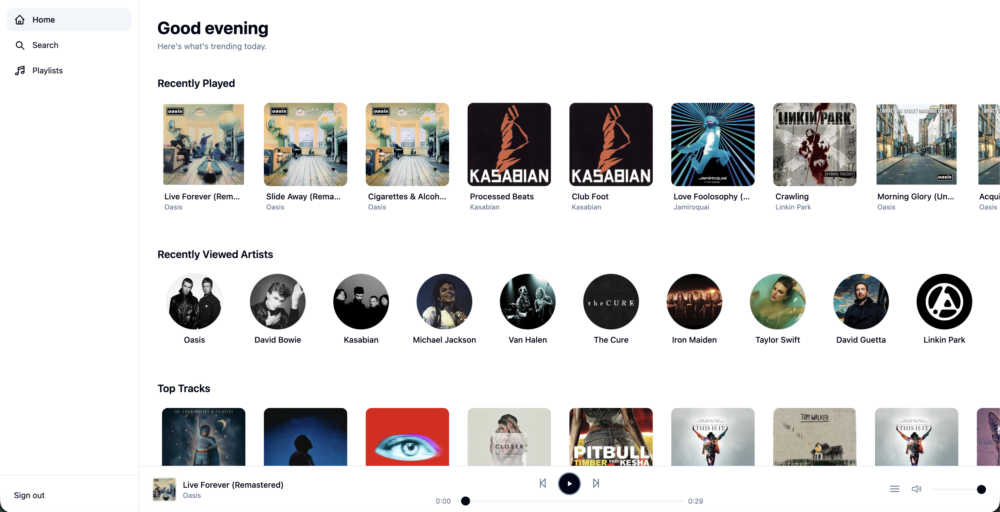
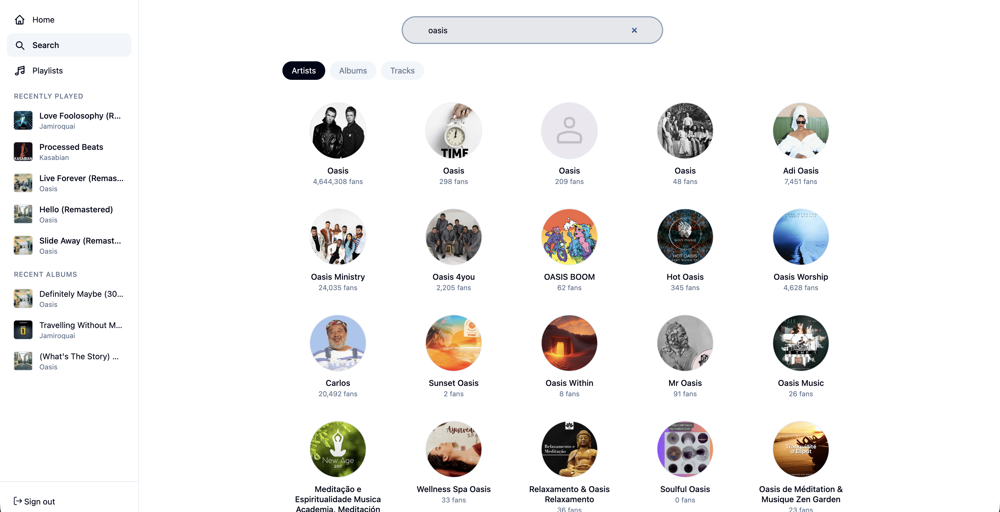
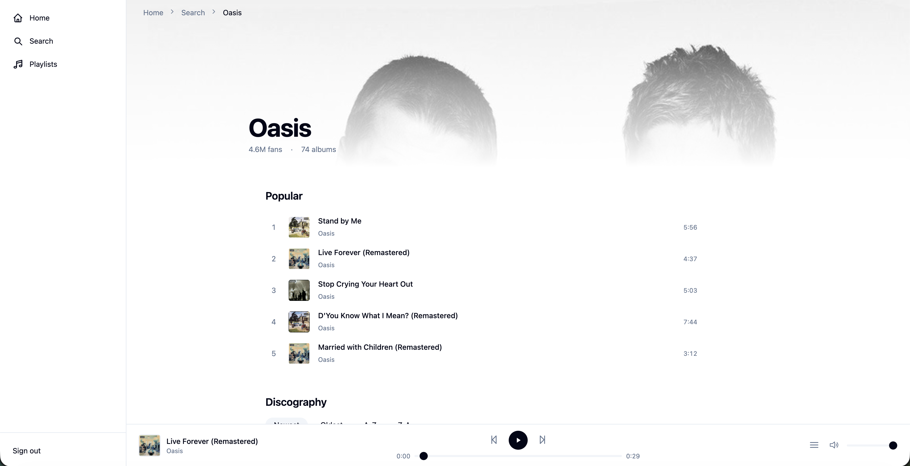
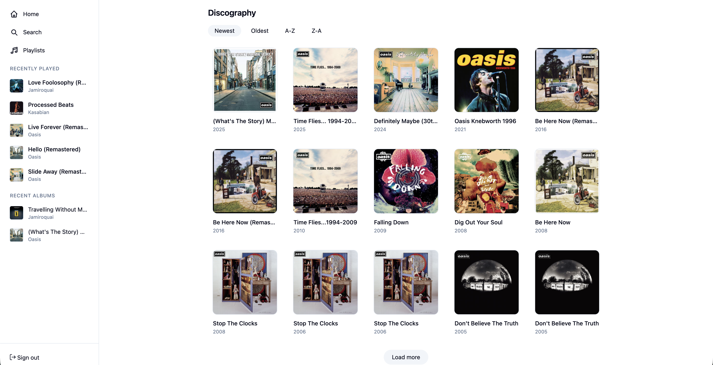
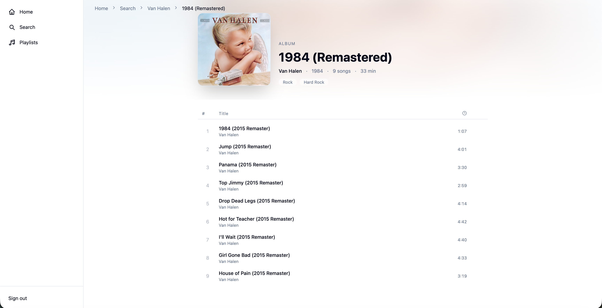
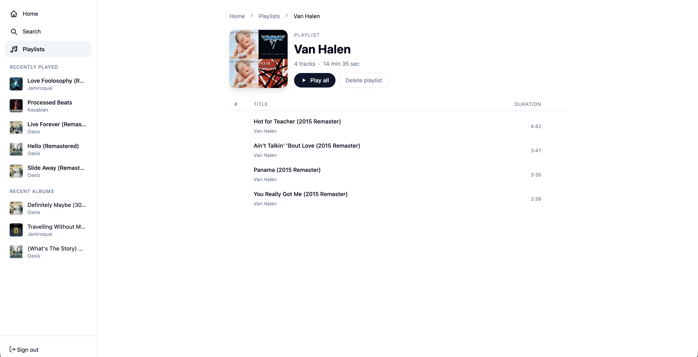
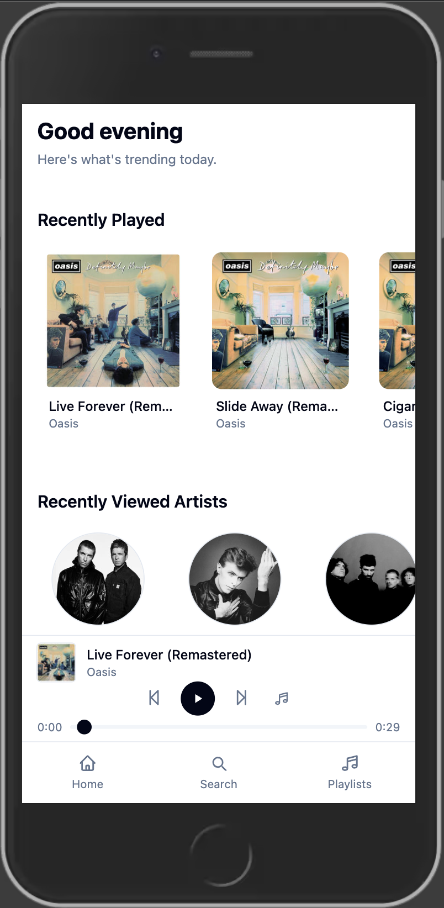
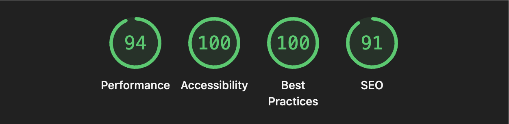

# Music App
This is a high-performance music exploration platform built with Angular 21, designed to provide a seamless, accessible, and reactive interface for the Deezer API. This project prioritises modern Angular patterns, moving away from legacy decorators and modules in favor of a Signals-first state management architecture.

---

## Table of Contents

- [Architecural Decisions](#architectural-decisions)
- [App Overview](#app-overview)
- [Lighthouse Performance](#lighthouse-performance)
- [Resources](#resources)

---
## Architectural Decisions

Here's a README section you can drop in:

---

## Architectural Decisions

### State Management — Signals over NgRx
I chose Angular's built-in signal primitives over NgRx for state management. Each feature owns an injectable signal store rather than a single centralised store. This keeps state co-located with the feature that owns it, reduces boilerplate significantly, and lazy-loads with the feature route. NgRx would have been justified for a larger team or more complex derived state, but for this scope signals give us reactivity with less overhead.

### RxJS
RxJS is used only where it genuinely outperforms signals. The primary use case is debounced search — `toObservable()` bridges the query signal into a stream, `debounceTime(300)` prevents API calls on every keystroke, and `switchMap` automatically cancels in-flight requests when the query changes. All other async operations use `subscribe()` directly or Angular's `HttpClient` without additional RxJS operators.

### Persistence — IndexedDB for Playlists, localStorage for Recent Activity
Playlist data is persisted to IndexedDB via a wrapper service. IndexedDB was chosen over localStorage because playlists are structured, potentially large, and benefit from transactional writes. Recent tracks and artists use localStorage since they are small, flat arrays that don't require querying. Both are rehydrated into their respective signal stores on app load.

---
## App Overview
### Home Page
When you first open the website, you will see the following home page that shows recently viewed artist, recently played songs, top tracks, top artists, etc. 

### Search Page
On the search page you can search by artist, album or even song title as seen below:

As you can see above, there is a navigation bar to the side with options for a search page, trending page, dashboard page, recent searches and settings which include theme toggling and signing out. 

### Artist Page
If an artist is selected above then you will be brought to a page that looks like the one below:

As you can see above the artist page contains top tracks as well as the entire discography of the artist which is also filterable.

### Album Page
If you select an album then you will be brought to a page like this where you can view and play the songs on that album:

### Playlist Page
The playlist page is similar to the album page but it is a page that shows the songs that you have added as a user:

### Mobile Responsiveness
This application has been designed with mobile responsiveness in mind and this can be seen below:

## Lighthouse Performance
Below you can see the lighthouse performance scores. The overall performance is excellent with a score of 94. It was a technical constraint to achieve 100% accessibility which can be seen below:

## Resources
The following were consulted in the making of this project:
- https://developers.deezer.com/api        
- https://developers.deezer.com/myapps       
- https://spartan.ng/documentation/installation 
- https://tailwindcss.com/docs                
- https://angular.dev    
- https://dribbble.com/search/music-app
- https://open.spotify.com/
- https://medium.com/@dragos.atanasoae_62577/angular-project-structure-guide-small-medium-and-large-projects-e17c361b2029
- https://primeng.org/icons
- https://developer.mozilla.org/en-US/docs/Web/API/IndexedDB_API
- https://developer.mozilla.org/en-US/docs/Web/API/IndexedDB_API/Using_IndexedDB#adding_retrieving_and_removing_data
- https://angular.dev/tools/cli/serve
- https://auth0.com/docs?tenant=dev-0aachqmr51vhi734%40prod-us-5&locale=en-us